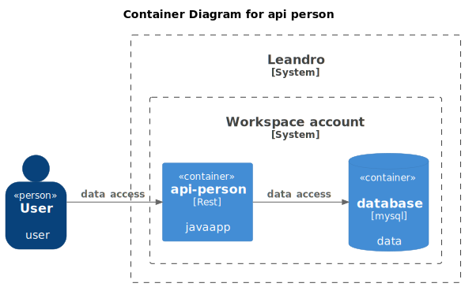

# api-person


#### Context Diagram - Api person




---

### Local setup

#### Install tools

- Java 17
- Maven 3
- [SDKMAN!](https://sdkman.io/install)


#### Build

```shell
mvn clean install -DskipTests
```

#### Test

```shell
mvn test -Dspring.profiles.active=test
```

#### Run

```shell
mvn spring-boot:run -Dspring-boot.run.profiles=staging -Dserver.port=8080
```


